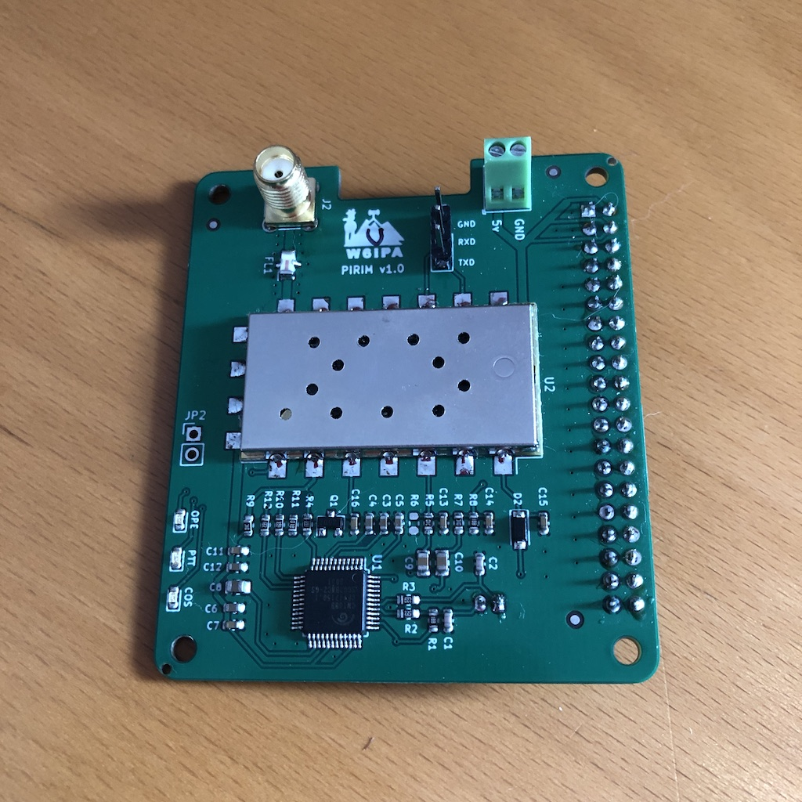

# SA818 Programming

My friend (W6IPA) and I developed a versatile Raspberry-Pi hat that
can be used for Allstar, Echolink, APRS, or any digital modes.

We use the program in this GitHub repository to program the radio
module SA818 used for the Pi-Hat.



We have some PCB left. We are selling them for [$25 on tindie][1].
You can also visit the this blog post [about this program][2]

**Before programming the SA818 module, make sure you consult the band
plan for your country and transmit on a frequency you are allowed to
use.**

## Intallation

The easiest way to install is program is to use the command `pip`. Pip
will automatically take care of installing the dependencies.

```
$ sudo pip install sa818
```

You can also clone this repository and use the setup.py script with
the following command. You will have to install the python package
`pyserial` manually. To install dependencies, refer to the manual of
your operating system.

```
$ git clone https://github.com/0x9900/SA818.git
$ sudo python3 setup.py install
```

## Example

```
[root@allstar ~]# sa818 version
SA818: INFO: Firmware version: V4.2

[root@allstar ~]# sa818 radio --frequency 145.230 --offset -.6 --ctcss 100
SA818: INFO: +DMOSETGROUP:0, BW: Wide, Frequency (RX: 145.2300 / TX: 144.6300), CTCSS (TX: 100.0 / RX: 100.0), squelch: 4, OK

[root@allstar ~]# sa818 volume --level 5
SA818: INFO: +DMOSETVOLUME:0 Volume level: 5
```

If you use an FTDI dongle to program the SA828 module the USB port can
be specified with the `--port` argument

```
[root@allstar ~]# sa818 --port /dev/ttyAMA0 volume --level 5
SA818: INFO: +DMOSETVOLUME:0 Volume level: 5
```

It is possible to specify a different CTCSS or DCS code for transmit and receive by separating the two codes by a comma (no spaces). For example, `--ctcss 100,88.5` will set the CTCSS 100Hz for transmit and 88.5Hz for receive.

## Usage

This program has for sections:

 - radio: Program the radio's frequency, tone and squelch level
 - volume: Set the volume level
 - filters: Turn on or off the [pre/de]-emphasis and as well as the high and low pass filter
 - version: display the firmware version of the SA818 module

```
usage: sa818 [-h] [--port PORT] [--debug]
                {radio,volume,filters,version} ...

generate configuration for switch port

positional arguments:
  {radio,volume,filters,version}
    radio               Program the radio (frequency/tome/squelch)
    volume              Set the volume level
    filters             Set filters
    version             Show the firmware version of the SA818

optional arguments:
  -h, --help            show this help message and exit
  --port PORT           Serial port [default: linux console port]
  --debug
```

### Radio

```
usage: sa818 radio [-h] --frequency FREQUENCY [--offset OFFSET]
                      [--squelch SQUELCH] [--ctcss CTCSS | --dcs DCS]

optional arguments:
  -h, --help            show this help message and exit
  --frequency FREQUENCY
                        Transmit frequency
  --offset OFFSET       0.0 for no offset [default: 0.0]
  --squelch SQUELCH     Squelch value (1 to 9) [default: 4]
  --ctcss CTCSS         CTCSS (PL Tone) 0 for no CTCSS [default: None]
  --dcs DCS             DCS code must me the number followed by [N normal] or
                        [I inverse] [default: None]
```

### Volume

```
usage: sa818 volume [-h] [--level LEVEL]

optional arguments:
  -h, --help     show this help message and exit
  --level LEVEL  Volume value (1 to 8) [default: 4]
```

### Filters

```
usage: sa818 filters [-h] [--emphasis EMPHASIS] [--highpass HIGHPASS]
                        [--lowpass LOWPASS]

optional arguments:
  -h, --help           show this help message and exit
  --emphasis EMPHASIS  Disable [Pr/De]-emphasis (yes/no) [default: no]
  --highpass HIGHPASS  Disable high pass filter (yes/no) [default: no]
  --lowpass LOWPASS    Disable low pass filters (yes/no) [default: no]
```

## CTCSS codes (PL Tones)
```
67.0, 71.9, 74.4, 77.0, 79.7, 82.5, 85.4, 88.5, 91.5, 94.8, 97.4,
100.0, 103.5, 107.2, 110.9, 114.8, 118.8, 123.0, 127.3, 131.8, 136.5,
141.3, 146.2, 151.4, 156.7, 162.2, 167.9, 173.8, 179.9, 186.2, 192.8,
203.5, 210.7, 218.1, 225.7, 233.6, 241.8, 250.3
```

## DCS Codes

DCS codes must be followed by N or I for Normal or Inverse:
> Example: 047I
```
023, 025, 026, 031, 032, 036, 043, 047, 051, 053, 054, 065, 071, 072,
073, 074, 114, 115, 116, 125, 131, 132, 134, 143, 152, 155, 156, 162,
165, 172, 174, 205, 223, 226, 243, 244, 245, 251, 261, 263, 265, 271,
306, 311, 315, 331, 343, 346, 351, 364, 365, 371, 411, 412, 413, 423,
431, 432, 445, 464, 465, 466, 503, 506, 516, 532, 546, 565, 606, 612,
624, 627, 631, 632, 654, 662, 664, 703, 712, 723, 731, 732, 734, 743,
754
```

[1]: https://www.tindie.com/products/w6ipa/radio-interface-module-pirim-for-raspberry-pi/
[2]: https://0x9900.com/programming-the-radio-module-sa818/
